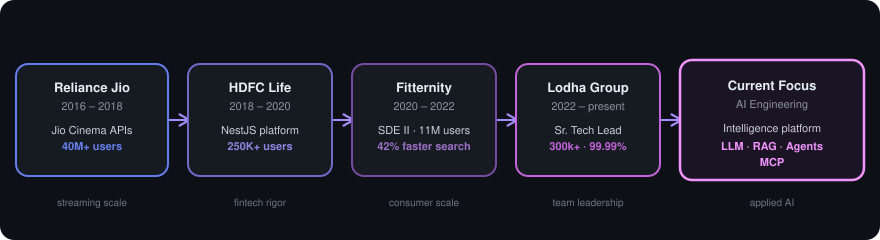

<!-- ===================== HEADER ===================== -->

  

  

  
  
  
  

<!-- ===================== ABOUT ===================== -->
<h2 align="center">About Me</h2>

<table align="center">
  <tr><td><b>Role</b></td><td>Senior Technical Lead (Backend)</td></tr>
  <tr><td><b>Company</b></td><td>Lodha Group / Digirealty Technologies</td></tr>
  <tr><td><b>Location</b></td><td>Thane, Maharashtra, India</td></tr>
  <tr><td><b>Experience</b></td><td>10+ years building high-scale backend systems</td></tr>
  <tr><td><b>Leading</b></td><td>BelleVie backend (300k+ residents) & an AI-powered engineering intelligence platform</td></tr>
  <tr><td><b>Architecture</b></td><td>Event-Driven Systems &bull; Microservices &bull; Distributed Systems</td></tr>
  <tr><td><b>AI / LLM</b></td><td>LLM Workflows &bull; RAG Implementation &bull; AI Agents &bull; MCP &bull; Prompt Engineering</td></tr>
  <tr><td><b>Beyond code</b></td><td>Jawa 42 rides &bull; Fitness &bull; Indian equity markets &bull; Content creation</td></tr>
</table>

<i>"First, solve the problem. Then, write the code."</i>

<!-- ===================== IMPACT ===================== -->
<h2 align="center">Impact in Numbers</h2>

<table align="center">
  <tr>
    <td align="center"><b>40M+</b> Users served</td>
    <td align="center"><b>1M+</b> API calls / month</td>
    <td align="center"><b>99.99%</b> Uptime</td>
    <td align="center"><b>2 &rarr; 25</b> Team scaled</td>
    <td align="center"><b>37%</b> Faster DB queries</td>
  </tr>
</table>

<!-- ===================== CAREER FLOW ===================== -->
<h2 align="center">Career Path</h2>

  

<!-- ===================== EXPERIENCE ===================== -->
<h2 align="center">Professional Journey</h2>

<table>
  <tr>
    <td valign="top" width="150"><b>Lodha Group</b> Apr 2022 – Present</td>
    <td><b>Senior Technical Lead (Backend)</b> 
    Spearheading <b>BelleVie</b>, a real-estate platform serving <b>300k+ residents</b>. Scaled engineering from <b>2 to 25</b> (+40% sprint throughput, 90%+ test coverage). Microservices handle <b>1M+ API calls/month at 99.99% uptime</b>; cut MongoDB response times <b>37%</b>. Leading the TypeScript/NestJS migration. Recipient of the <b>Circle of Excellence</b> award.</td>
  </tr>
  <tr>
    <td valign="top"><b>AI Platform</b> Current focus</td>
    <td><b>AI-Powered Engineering Intelligence</b> 
    Python agents processing Jira data with business-day-aware SLAs, plus predictive <b>bug-debt & capacity-risk forecasting</b>. Hands-on with LLM workflows, <b>RAG</b> (embeddings, vector retrieval, grounded outputs), and MCP automation.</td>
  </tr>
  <tr>
    <td valign="top"><b>Fitternity</b> 2020 – 2022</td>
    <td><b>SDE II</b> 
    Backend for <b>21K+ partners, 75+ corporates, 11M users</b>. Refactored Elasticsearch & caching for a <b>42% query gain</b>; built subscription, PayPerSession & real-time booking systems.</td>
  </tr>
  <tr>
    <td valign="top"><b>HDFC Life</b> 2018 – 2020</td>
    <td><b>Software Engineer</b> 
    Built & maintained a high-performance NestJS platform consumed by <b>250K+ users</b> via the HDFC Securities app; deep exposure to trading platform architecture.</td>
  </tr>
  <tr>
    <td valign="top"><b>Reliance Jio</b> 2016 – 2018</td>
    <td><b>Associate Software Engineer</b> 
    Core APIs for <b>Jio Cinema (40M+ users, 100K+ assets)</b>: high-availability streaming, metadata, and personalized recommendations.</td>
  </tr>
</table>

<!-- ===================== TECH STACK ===================== -->
<h2 align="center">Tech Arsenal</h2>

<b>Languages</b>

  

<b>Backend & APIs</b>

  

<b>Data & Messaging</b>

  

<b>Cloud & DevOps</b>

  

<b>Frontend</b>

  

<b>AI / LLM</b>

  
  
  
  

<!-- ===================== FEATURED PROJECT ===================== -->
<h2 align="center">Featured Project</h2>

<table align="center">
  <tr>
    <td align="center" colspan="4"><b>KnowYourMoney Better</b> <i>Privacy-first, fully in-browser personal finance tool — your data never leaves your machine</i></td>
  </tr>
  <tr>
    <td align="center" width="150">Statement Parsing UPI narration</td>
    <td align="center" width="150">Tax Reconciliation AIS / Form 16</td>
    <td align="center" width="150">Regime Comparison Old vs New FY25-26</td>
    <td align="center" width="150">Capital Gains Auto computation</td>
  </tr>
  <tr>
    <td align="center" colspan="4">
      
      
      
      
    </td>
  </tr>
</table>

<!-- ===================== EDUCATION ===================== -->
<h2 align="center">Education & Certifications</h2>

<table align="center">
  <tr><td><b>BE, Information Technology</b></td><td>Ramrao Adik College of Engineering &middot; 2016</td></tr>
  <tr><td><b>AI Fluency Framework & Foundations</b></td><td>Apr 2026</td></tr>
  <tr><td><b>AI Agents & Agentic AI</b></td><td>Vanderbilt University &middot; Jul 2025</td></tr>
  <tr><td><b>Prompt Engineering</b></td><td>Vanderbilt University &middot; Jul 2025</td></tr>
</table>

<!-- ===================== STATS ===================== -->
<h2 align="center">GitHub Analytics</h2>

  
  

  

  

<!-- ===================== FOOTER ===================== -->

  

